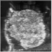
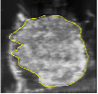

# Breast Cancer Image Segmentation Using UNet

## Introduction
The proposed project aims to develop an automated tool for analyzing photoacoustic (PA) images obtained during breast conserving surgery (BCS). BCS is a common treatment for breast cancer, but up to 20% of cases require a secondary surgery due to incomplete tumor removal. PA imaging provides real-time feedback to surgeons during BCS, but image analysis and comparison with conventional imaging techniques is necessary to validate its performance. The validation process involves segmentation of breast cancer tissue in each image, which is a time-consuming and challenging task. This project will develop an automated segmentation tool using machine learning to improve accuracy and enable the analysis of large quantities of data in a more efficient manner. As a first step, the project will focus on the development of the tool for analyzing ultrasound images obtained in a clinical study that compared PA imaging with conventional ultrasound imaging. The ultimate goal of the project is to improve the accuracy and effectiveness of BCS and reduce the need for secondary surgeries, improving patient outcomes and quality of life.

## Dependencies
* Python 3.9+
* TensorFlow 2+
* Numpy
* Scikit-image
* Tifffile

## Data
The study utilized 54 3D images of freshly excised breast cancer ex-vivo specimens, which were sliced into multiple 2D images resulting in approximately 1080 2D US images. An example of the 2D US image of the ex-vivo breast cancer specimen can be seen in figure below. The ground truth for algorithm training was provided by human-guided segmentation, which was obtained from two different observers to address the variation in segmentation between users. The second figure shows the human segmented image. Due to the confidential nature of the patient information, only a few slices of the data were shown in the results section anonymously. As such, the complete dataset cannot be publicly shared.

<div>


</div>

## Data Preparation
The data preparation is done in `DataPreparation.py` under the `utils` directory. The following steps were taken to prepare the data:
* Reading all the images from the dataset using `tifffile`.
* Extracting 2D slices of 3D images and masks separately.
* Applying augmentation techniques such as rotation and cropping to the initial images and corresponding masks to create more samples for training.
* Normalizing the images by dividing by 255.

## Models and Training
The `models/` directory contains implementation of 2D and 3D UNet architectures. Both implementations use a series of convolutional and pooling layers to downsample the input image, and then upsample it back to its original size. The difference between the 2D and 3D models is that the 3D model uses 3D convolutional layers instead of 2D convolutional layers.
The `train.py` script is used for training the models. The script reads in the training and testing datasets created by the data preparation script, and trains the models using the specified hyperparameters. The script saves the trained models to the `models/trained_model/` directory, and also generates graphs of the training and testing processes, which are saved to the `results/graphs/` directory.
<div>


</div>

## Results
The results of the model training and evaluation are stored in the `results` directory. This includes the following:
* Plots of the loss and dice-coef during training.
* The trained models are saved in the `trained_models` directory.
* The segmentation results are stored in the `results` directory.

Figure below shows the results of the segmentation on 4 random slices out of test set.


<div>

</div>

Finally dice coefficient score of 92.77% was achieved on test set.
## Conclusion
In this project, we successfully segmented breast cancer cells using the UNet architecture. We were able to achieve high accuracy on both the training and test sets. The use of data augmentation techniques helped to increase the size of the training set, which led to improved model performance.

## Usage
To use this project, first, clone the repository:

## Contributors
- Pouya Beig heidari
- Elina Rascevska

## Acknowledgments

University of South Florida for providing the dataset
    


```python

```
